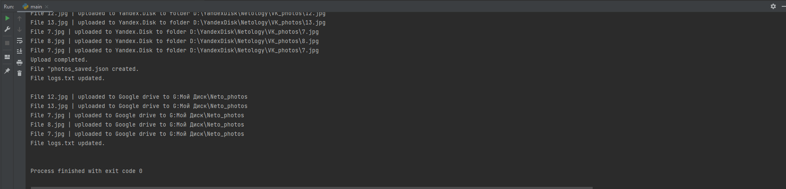

# Backup

### Goal

The goal is to make a script that saves photos from social network [Vkontakte](https://vk.com/)'s profiles to the cloud storages 
Yandex.Disk and Google Drive.

### Instructions
You need to write the program with the following conditions:
1. Program asks VK user id, album id and how many photos to save.
2. Program saves photos to `vk_photos` folder in working directory. Photos are saved in the maximum size (width/height in pixels). 
Photo's file name is the number of it's likes. If some photos have the same number of likes, upload date is added to the file name.
3. Program uploads photos to user's cloud storages Yandex.Disk and Google Drive
4. The information on saved photos is written to `photos_saved.json` in the following format:

```
    [{
    "file_name": "34.jpg",
    "size": "z"
    }]
```

6. Program logs are written to the `log.txt`.

### How to:
1. Install requirements from `requirements.txt` with the following command `pip install -r requirements.txt`.
2. Create an app in [VK Developers](https://dev.vk.com/) to get the token to access VK API (write it `config.py`).
3. Get a Yandex.Disk OAuth-token from [here](https://yandex.ru/dev/disk/poligon/) (write it to `config.py`).
4. Create an app in [Google Developers Console](https://console.cloud.google.com/apis/dashboard?hl=RU&project=ace-momentum-357717) to access Google Drive with it
(write client_secret, client_id and other information to `clients_secrets.json`).
6. Go to `main.py` and enter 'user_id', 'album_id' and 'count' values in `main.py`. Run the file.

### Result:

